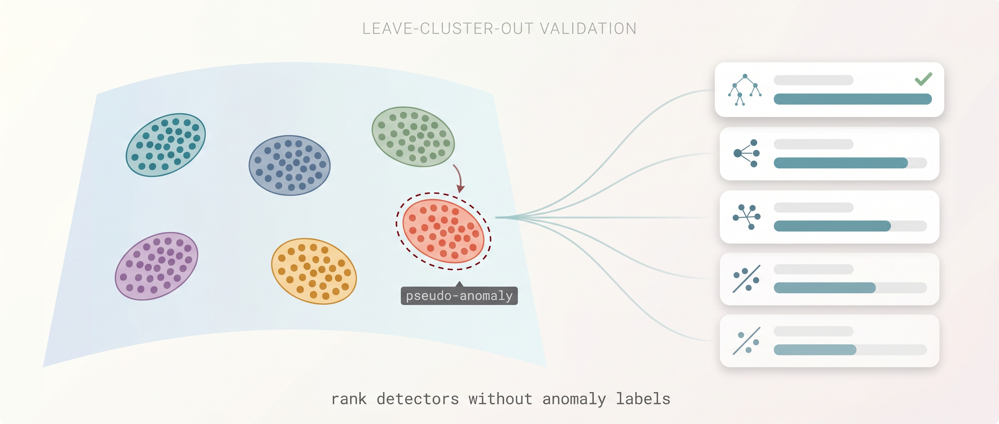

# AutoAD

### Picking the best anomaly detector when you have no anomalies

<p align="center">
  
</p>

<p align="center">
  <a href="https://apartsinprojects.github.io/AutoAD/"><b>Paper blueprint</b></a>
  &nbsp;|&nbsp;
  <a href="implementation%20plan.md">Implementation plan</a>
  &nbsp;|&nbsp;
  <a href="plan/anomaly_detection_model_selection_plan.md">Research plan</a>
</p>

---

## The problem

Anomaly detection is deployed exactly where labeled anomalies are scarce, expensive, or unrepresentative: medical signals, cybersecurity, fraud, industrial sensors, predictive maintenance, scientific telemetry. A practitioner can train dozens of detectors on the available normal data, but **cannot reliably choose between them without labels**. Across the standard time-series benchmark (TSB-AD, 1,070 series), the gap between the best and the median model on a single dataset routinely exceeds 0.30 VUS-PR. Picking the wrong detector is the difference between catching failures and missing them.

The model-selection problem in AD is therefore a *fundamental, daily, expensive* problem that the field has not solved.

## Why prior work falls short

* **Internal performance measures** (IREOS, ASOI, score-distribution heuristics) are statistically indistinguishable from random selection in a 297-detector study by Ma &amp; Zhao [SIGKDD Explorations 2023].
* **Meta-learning** approaches (MetaOD NeurIPS 2021, MSAD PVLDB 2023) require a historical performance database and assume future anomalies resemble the meta-training distribution. They transfer poorly out-of-distribution.
* **Synthetic-injection methods** (Goswami et al. ICLR 2023 Oral) inject a single perturbation family and aggregate three signals via heuristic Borda. State of the art for zero-label time-series selection, but brittle when anomaly types vary.

A reliable, label-free, single-dataset selection protocol is the open problem.

## Our hook: leave-cluster-out validation

Normal data carries enough structural information to rank detectors.

We introduce **Leave-Cluster-Out (LCO) validation**: cluster the normal training data, hold out one cluster, train the candidate on the rest, and score the holdout as a *pseudo-anomaly*. The detector that best separates the held-out cluster from the rest is, *empirically*, more likely to be the one that separates real anomalies from normal data. To our knowledge no prior published method uses cluster-holdout for AD model selection.

LCO alone is not enough. We combine three pseudo-anomaly sources via an **anomaly-type-aware** rank-fusion combiner:

1. **LCO at multiple granularities and clustering algorithms**, with model-independent fold-difficulty stratification (data-domain and latent-domain variants);
2. **Six structured synthetic perturbation families** (point, level shift, trend, frequency, contextual, mode exclusion), disjoint from the test set;
3. **Prediction-residual consistency** (stationarity and entropy of normal-data residuals from forecasting models).

The combiner reweights sources based on a categorical *anomaly-type prior* inferred from normal-data diagnostics — never from anomaly labels.

## Why it matters

Reliable normal-data-only AD model selection unlocks production deployment in every domain where labels arrive too late or never:

* **Medical monitoring** &mdash; physiological signal anomaly detection without per-patient ground truth.
* **Predictive maintenance** &mdash; industrial sensor failure detection where failures are by definition rare.
* **Cybersecurity** &mdash; attack detection on telemetry that has never been attacked yet.
* **Fraud monitoring** &mdash; new fraud patterns that historical data does not capture.
* **Scientific telemetry** &mdash; instrument anomaly detection (satellite, particle physics, sensor networks).

It also closes the gap between the Ma &amp; Zhao 2023 negative result (IPMs no better than random) and the empirical demand for a positive method.

## Target outcomes

| Metric | Target | Comparison |
|---|---|---|
| Mean VUS-PR selection regret | &lt; 0.05 | vs. ~0.10 for default Isolation Forest |
| Top-1 selection accuracy | &ge; 30 % | random &asymp; 2 % (1 / 60 candidates) |
| Beat Goswami (ICLR 2023 Oral) | &ge; 0.03 absolute | paired bootstrap p &lt; 0.01 |
| OOD result vs MSAD (PVLDB 2023) | win by 0.018-0.027 | despite using no historical labels |
| Failure-mode characterization | explicit | clear (anomaly type x diagnostic) cells |

## What is in this repository

* [`index.html`](index.html) - **paper blueprint** with simulated headline results (red ink); served via GitHub Pages at <https://apartsinprojects.github.io/AutoAD/>
* [`implementation plan.md`](implementation%20plan.md) - locked engineering plan: datasets, candidate pool, week-by-week schedule, artifact persistence, smoke tests, computational principles
* [`plan/anomaly_detection_model_selection_plan.md`](plan/anomaly_detection_model_selection_plan.md) - the broader research plan
* `src/autoad/` - source code (data loaders, models, LCO, synthetic perturbations, aggregation, regret, robustness)
* `scripts/` - phase entry points; data download
* `tests/smoke/` - phase smoke tests, each runs end-to-end on minimal data in &lt; 5 min
* `vendored/` - upstream code from TSB-AD, Goswami, MSAD (gitignored, cloned at setup)

## Status

| Phase | What | Status |
|---|---|---|
| 0 | Repo, env, BaseAD interface, registry, ECDF normalization | done |
| 0 | Three reference detectors (IForest, LOF, OCSVM) with hyperparameter grids | done |
| 0 | Artifact-persistence harness (parquet with provenance) | done |
| 0 | Smoke-test framework (32 tests, ~70s end-to-end) | done |
| 1 | UCR Anomaly Archive 2021 loader (250 series) | done |
| 1 | Synthetic suite with deterministic train/test split | done |
| 1 | Windowing utilities (sliding window + per-point reduction) | done |
| 2 | Oracle pipeline (E2E demo: 6 candidates &times; UCR + synthetic, AUC-PR, AUC-ROC) | done |
| 3 | Source 1 LCO (data-domain + PCA-latent, multi-granularity, difficulty-stratified) | done |
| 3 | Source 2 (synthetic perturbation scoring) | done |
| 3 | Rank aggregation (Borda + Kendall agreement) | done |
| 3 | Selection regret + summaries | done |
| 2 | Full 60-candidate pool (12 more model families) | pending |
| 2 | TSB-AD, SMD, MSAD-relevant TSB-UAD downloads | pending |
| 4 | Type-aware combiner | pending |
| 5 | Six baseline ports (Goswami, MSAD, N-1 Experts, Idan, IREOS, ASOI) | pending |
| 6-7 | Main experiments, ablations, failure-mode analysis | pending |

## Quick start

```bash
# Python 3.11 is required
python -m venv .venv
source .venv/Scripts/activate          # Windows Git Bash
pip install --upgrade pip wheel

# CUDA 12.1 PyTorch (omit --index-url for CPU-only)
pip install --index-url https://download.pytorch.org/whl/cu121 "torch>=2.2,<2.5"

# Install AutoAD + remaining deps
pip install -e .

# Download UCR Anomaly Archive 2021 (~184 MB)
python scripts/01_download_ucr.py

# Run smoke tests (~ 70s on a laptop)
pytest tests/smoke/ -v

# Run a working end-to-end demo (single model, two hyperparams, two datasets)
python scripts/02_run_e2e_minimal.py --ucr-limit 20 --synth-per-family 5

# Run the full MS-PAS demo (oracle + LCO data + LCO latent + Source 2 + selection + regret)
python scripts/03_run_e2e_full.py --ucr-limit 10 --synth-per-family 5
```

## Citation

A paper is in preparation. The blueprint and references are available at the project page.

## License

MIT.
